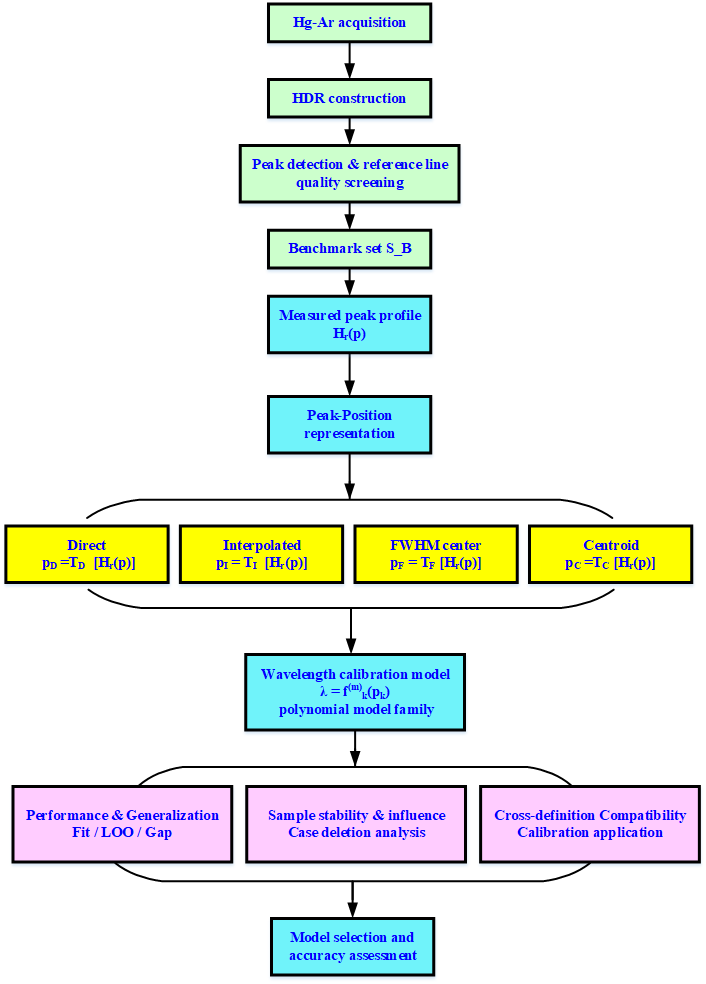
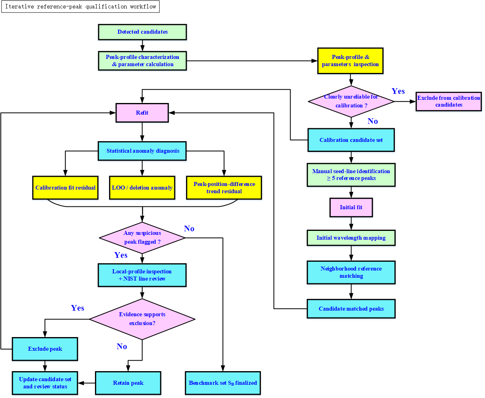

# WCC4SM V1.0 软件架构与开发流程全景说明

| 项目 | 内容 |
|------|------|
| 软件名称 | WCC4SM（Wavelength Characterization and Calibration for Spectrometer，阵列光谱仪波长表征与定标软件） |
| 文档版本 | V1.0 |
| 对应软件 | WCC4SM V1.0（入口 `WCC4SM_V1_0.m`） |
| 运行环境 | MATLAB R2022a 或更高版本，需 Signal Processing Toolbox（`findpeaks`） |
| 文档定位 | 面向"回头看"的整体架构梳理：解释迭代开发后软件**当前真实的**分层结构、运行时状态模型、数据处理主流程与专家分析工作区，帮助重新建立对整体的清晰认识 |
| 配套框图 | `fig1a-block-v2.png`（总体方法学流程）、`fig1b-block-v1.png`（迭代式参考峰资格化工作流） |

---

## 1. 一句话定位

WCC4SM 是一个以 **MATLAB 单体桌面 GUI 为表现层、以 `src/` 下 37 个无状态算法函数为计算层** 的科学分析软件，围绕一条核心科学问题展开：

> 在近极限采样条件下，**峰位定义（Direct / Interpolated / FWHM center / Centroid）如何影响波长定标多项式模型的选择与精度评估**，并通过留一验证、点影响分析、子集设计、跨定义兼容性等多维证据，得到可解释、可复现、可追溯的定标模型。

软件既是日常分析工具，也是论文方法学（第 1～6 章）的**可执行实现**。

---

## 2. 总体分层架构

软件在物理目录上是"扁平 + 分层"的混合结构。逻辑上可划分为六层：

```
┌──────────────────────────────────────────────────────────────────────┐
│  ① 表现层 / GUI 层                                                     │
│     WCC4SM_V1_0.m（5222 行，单体 uifigure，约 250 个嵌套回调/绘图函数）  │
│     职责：界面构建、事件回调、状态持有、表格与图形渲染、会话编排          │
└───────────────┬──────────────────────────────────────────────────────┘
                │ 在关键计算点调用（共约 35 处调用）
┌───────────────▼──────────────────────────────────────────────────────┐
│  ② 算法层 / 无状态函数库      src/wc4sm_*.m（37 个，7～190 行/个）       │
│     数据读取 · 预处理 · 峰表征 · 定标拟合 · LOO · 交叉验证             │
│     点影响 · Add-One · 种子稳定性 · 窗划分 · 子集设计 · Beam Search     │
│     模型距离 · ε-覆盖 · 性能指标 · 参考表格式化 · CSV 导出             │
└───────────────┬──────────────────────────────────────────────────────┘
                │ 读 / 写
┌───────────────▼──────────────────────────────────────────────────────┐
│  ③ 数据资产层                                                          │
│     reference_data/  NIST 主谱库(.lit) + 选择模式匹配表(Mode01/02/03)   │
│     test_data/       实测光谱、暗场、经典案例(oto_HDR_20260814z.csv)    │
└───────────────┬──────────────────────────────────────────────────────┘
                │ 保存 / 恢复（.mat，FormatVersion 1.0）
┌───────────────▼──────────────────────────────────────────────────────┐
│  ④ 持久化层 / Session      wc4sm_create/save/load/validate_session     │
│     把一次完整分析工作流（数据、峰、匹配、模型、子集设计、UI 设置）       │
│     序列化为单个可追溯的工程文件，支持中断后无损恢复                     │
└──────────────────────────────────────────────────────────────────────┘

  ⑤ 测试层    tests/Test*.m（17 个 matlab.unittest 测试类，112 个用例）
              + run_wc4sm_tests.m 统一回归入口（非 GUI，可在无显示环境运行）

  ⑥ 构建部署层  tools/build_windows_exe.m（mcc 打包 Windows EXE）
                tools/build_docx_from_markdown.m（文档生成）
                多版本入口 WCC4SM_V0_9 / V0_9_2 / V0_9_3 / V1_0
```

**关键架构特征**：计算逻辑与界面**正在逐步分离，但尚未完全分离**。新增的、可测试的能力（定标、LOO、交叉验证、子集设计等）都沉淀在 `src/`；而早期形成的部分流程（初始映射、局部多项式辅助、界面状态编排）仍以内联方式留在 GUI 文件内。这是迭代开发最典型的痕迹，详见第 11 节。

---

## 3. 目录结构与职责

```
WCC4SM_V0_9_3_package20260901a/
├── WCC4SM_V1_0.m            ★ 当前主入口（单体 GUI，V1.0 论文服务版）
├── WCC4SM_V0_9_3.m          V0.9.3 入口（保留以复现既往工作流）
├── WCC4SM_V0_9_2.m          兼容垫片：发出告警后转调 V0_9_3
├── WCC4SM_V0_9.m            V0.9 入口（2554 行，较早的单体版本）
├── run_wc4sm_tests.m        非 GUI 回归测试统一入口
│
├── src/                     37 个无状态算法函数（详见第 9 节模块清单）
│
├── reference_data/          可溯源参考波长资产
│   ├── NIST_ASD_HgAr_20260729.lit         7/29 NIST 主谱库（322 行）
│   ├── NIST_ASD_HgAr_20260910.lit         9/10 NIST 主谱库（326 行，补弱峰）
│   ├── NIST_ASD_HgAr_20260729_Metadata.md 谱库元数据/溯源说明
│   ├── WCC4SM_NIST_ASD_HgAr_20260729_Mode01.csv   选择模式 01
│   ├── WCC4SM_NIST_ASD_HgAr_Mode02_20260817.csv   选择模式 02
│   ├── WCC4SM_NIST_ASD_HgAr_Mode03_20260910.csv   选择模式 03（63 条）
│   └── examples/HgAr_Avantes_Example.lit
│
├── test_data/               实测数据
│   ├── Spectrum_1_8ms_avg50.csv           样品明场光谱（两列）
│   ├── Spectrum_1_dark_8ms_avg50.csv      配套暗场
│   └── oto_HDR_20260814z.csv              经典案例 HDR 光谱（像素-强度）
│
├── tests/                   17 个测试类（见第 10 节）
├── tools/                   EXE 打包、文档生成脚本
├── docs/                    说明书、算法定义、验收、论文稿、流程框图等
├── README.md / CHANGELOG.md / LICENSE / NOTICE / .gitignore
└── result/ build/           运行/构建产物（.gitignore 排除）
```

---

## 4. 运行时架构：单体 GUI + 闭包共享状态

### 4.1 为什么是一个 5222 行的文件

`WCC4SM_V1_0.m` 是一个 MATLAB 主函数，内部使用了 MATLAB 的**嵌套函数（nested function）闭包**机制：

- 主函数开头声明**全部应用状态变量**（约 60 个，见 4.2）；
- 后续约 250 个嵌套函数（回调、绘图、刷新、对话框）**直接读写这些变量**，无需通过参数层层传递；
- 任何回调修改状态后，调用对应的 `refresh*` / `draw*` 函数刷新界面。

这种模式在 MATLAB 科学工具中很常见：**交互逻辑密集、状态共享频繁时开发效率高**；代价是状态作用域很大、函数间隐式耦合强、难以对 GUI 层做单元测试。这也是为什么所有可独立验证的科学计算都被持续抽到 `src/` 中。

### 4.2 核心运行时状态对象（主函数开头的共享变量）

| 状态变量 | 类型/结构 | 承载的阶段 |
|----------|-----------|------------|
| `D` | `emptyData()`：raw / dark / corrected / normalized / pixel / inputX / calibratedWavelength / xKind / PixelCoordinateMode / PixelFirst/Last | 光谱数据与预处理结果、坐标模式 |
| `R` | 参考谱显示用结构 | 参考显示 |
| `Lbasic / Lpaper / Lnim / Lexternal / L` | 线库结构（wavelength/intensity/order/effective/enabled/source） | 内置 Basic 21、Paper 24、NIM 34、外部库，`L` 为当前生效库 |
| `peaks` | 峰检测候选数组（ID/Index/Pixel/Height/Prominence/Width/Status/Result） | 检测阶段 |
| `localCandidates` | 局部检索补检候选 | 弱峰补检 |
| `peakDataset` | 已确认峰参数数据集（含 FWHM/ERW/各峰位、状态） | 峰表征确认后 |
| `calPairs` | 定标匹配对（PeakID/ReferenceIndex/Wavelength/Order/Mode/Confidence/Locked/Status） | 匹配与定标集合 S_B |
| `provisional` | 初始/临时映射模型（a,b,RMS…） | ≥5 条种子线的初始线性映射 |
| `finalModel` / `appliedModel` / `appliedModelName` | 最终多项式模型 / 当前应用模型 | 定标与应用 |
| `calibrationModels` | 模型比较库（可导入多个模型） | Model Comparison |
| `optimizationPath / optimizationStability / optimizationOrder` | Add-One 路径 / 多种子稳定性 / 阶次扫描 | Calibration Optimization |
| `influenceResult / influenceOrderStats / seedComboResult` | 点影响 / 跨阶次影响 / 集合替换 | Point Influence、Set replacement |
| `subsetDesignProfile / subsetBeamState / subsetDesignCandidates / subsetWindowPartition / windowSelectedMask` | 影响排序画像 / Beam 搜索状态 / 候选 / 窗划分 / 窗选样 | Set Design |
| `positionCrossResult` | 4×4 跨峰位定义交叉验证矩阵及残差 | Model Validation |
| `paperPeakDifference*`（一组变量） | 论文峰差工作区的排除集、选中集、归档对、拟合结果 | Calibrated Performance |
| `matchingAxisMode / mainAxisMode` | Pixel / Wavelength 轴模式 | 全局坐标显示 |
| `sessionMetadata / currentSessionPath` | 操作者/仪器/测量/溯源元数据、当前会话路径 | Session 持久化 |
| `C` | 配色表 | UI 渲染 |

### 4.3 界面布局：顶部工具栏 + 三栏

主窗口采用 `uigridlayout` 的 2 行 3 列网格：

```
┌──────────────────────────── 顶栏（跨三列）────────────────────────────┐
│ 标题   OPEN FIG 下拉 │ OPEN FIG │ SAVE SESSION │ LOAD SESSION │ HELP │
├──────────────┬───────────────────────────────┬──────────────────────┤
│ ② 左控制栏    │ ① 中央绘图区（11 个工作区标签） │ ③ 右数据栏（5 个标签） │
│  330 px      │        自适应（主）             │      400 px          │
│ 4 个标签：    │  见 4.4                        │  Peak List           │
│ Data&Display │                                │  Peak Dataset        │
│ Peak Detection│                               │  Matching            │
│ Current Peak │                                │  Calibration Fit     │
│ Reference Lines│                              │  Peak-difference data│
└──────────────┴───────────────────────────────┴──────────────────────┘
```

- **左栏 = "做什么"（参数与动作）**：加载数据、预处理/显示参数、峰检测阈值、当前峰确认、参考线库管理。
- **中栏 = "看什么"（图形工作区）**：11 个标签页承载全部可视化分析。
- **右栏 = "数据是什么"（表格）**：峰列表、确认后的峰数据集、匹配对、定标拟合结果、论文峰差双侧表。

### 4.4 中央 11 个工作区标签（按工作流顺序）

| # | 标签 | 作用 | 主要支撑模块 |
|---|------|------|--------------|
| 1 | Peak Analysis | 当前光谱 + 选中峰局部图；8×8 峰形画廊 | `wc4sm_analyze_peak` |
| 2 | Peak Parameter Statistics | FWHM/ERW 趋势、关系图、峰位差总览 | `wc4sm_fit_peak_position_difference` |
| 3 | Wavelength Matching | 邻域参考线匹配交互视图 | GUI 编排 + 匹配对状态 |
| 4 | Calibration Fit & Residuals | 最终多项式拟合与残差 | `wc4sm_fit_calibration` |
| 5 | Model Validation | 4×4 峰位定义交叉验证、概览、残差热力图 | `wc4sm_cross_validate_peak_positions` |
| 6 | Model Comparison | 多模型叠加比较、残差诊断 | `wc4sm_model_distance`、LOO |
| 7 | Selected Residuals | 选中单元格残差序列与直方图 | 交叉验证/比较结果 |
| 8 | Calibrated Performance | 波长域性能、论文峰位-波长依赖分析 | `wc4sm_calculate_calibrated_performance` |
| 9 | Calibration Optimization | Add-One 路径、种子稳定性、阶次扫描 | `wc4sm_analyze_add_one*`、`*_seed_*`、`*_model_order` |
| 10 | Point Influence | 逐点删除影响、跨阶次曲线、集合替换 | `wc4sm_analyze_point_influence`、`*_influence_orders`、`*_seed_replacements` |
| 11 | Set Design | 影响画像、窗划分、确定性子集、分层 Beam Search | `wc4sm_partition_subset_windows`、`*_generate_subset_mask`、`*_backward_beam_*`、`*_epsilon_cover` 等 |

每个工作区都可通过顶栏 **OPEN FIG** 把当前子图弹出为独立可编辑 MATLAB 图窗，供论文出图。

---

## 5. 核心数据处理主流程（对应框图 fig1a）

下图反映的是**科学方法主线**（软件各工作区正是按此链条组织）：



### 阶段 0：Hg-Ar 采集与 HDR 构建

- 输入为 Hg-Ar 灯实测光谱（单列强度或"X,强度"两列），可加载配套暗场。
- `wc4sm_read_spectrum_file` 负责读取与规整（单列时按 `pixelStart` 生成像素序号；两列时按波长/像素解释）。
- HDR（高动态范围）合成在数据进入软件前/导入时完成；软件内通过 `wc4sm_preprocess_spectrum` 做**暗场/手动基线扣除 → 负值钳制 → 峰值归一化**。暗场优先于手动基线（与 V0.5.1 行为一致）。

### 阶段 1：峰检测与参考线质量筛选

- 用 `findpeaks` 在归一化谱上按高度/突出度/距离/宽度阈值检测候选峰；支持**局部开窗补检弱峰**（Local Search 对话框），补检峰与自动检测峰统一编号管理。
- 参考线来自当前生效线库 `L`（Basic 21 / Paper 24 / NIM 34 / 外部 `.lit`）。主谱库是**可溯源的唯一来源**，内置三套只是可复用的"选择模式"；被禁用的谱线仍保留在主库中，仅从当前模式排除。

### 阶段 2：基准集 S_B 的形成（峰确认 + 表征）

对每个候选峰在局部窗口内调用 `wc4sm_analyze_peak`，在**不做模型拟合**的前提下完成表征：

- 局部基线（linear / constant / none）扣除；
- spline / pchip / linear 加密插值（默认 20 倍细分，仅提升数值定位，不提升物理分辨率）；
- 计算四类峰位与多个峰形量：

| 符号 | 名称 | 定义 |
|------|------|------|
| p_D | Direct peak | 局部基线扣除后原始采样的最大值位置 |
| p_I | Interpolated peak | 插值加密信号的最大值位置 |
| p_F | FWHM center | 左右半高交点的中点 |
| p_C | Centroid | 确认全峰窗上净信号的一阶矩 |
| — | FWHM / HWHM | 半高全宽 / 左右半宽 |
| — | ERW | 净峰面积 / 净峰高（等效矩形宽） |
| — | SamplingRatio | FWHM（或 ERW）相对局部采样间隔的倍数，用于判断近极限采样程度 |

GUI 中还提供 **Gaussian fit** 峰位（界面内的高斯拟合定位），因此界面下拉里出现 5 种峰位；而论文交叉验证矩阵严格使用 4 种定义（Direct/Interpolated/FWHM center/Centroid）。

确认（CONFIRM）后的峰进入 `peakDataset`，成为可参与匹配/定标的数据集；可单峰确认、批量预分析（仅预览）、确认并跳下一个、排除/恢复。

### 阶段 3：波长定标模型（多项式族）

- 匹配对 `calPairs` 把"已确认峰像素位"与"参考波长"绑定，带阶次、匹配模式、置信度、锁定、状态等属性。
- 初始映射：手动指定 **≥5 条种子参考线**后做初始线性拟合，得到像素→波长的初步映射，用于把参考谱叠加到实测谱上做邻域匹配。
- 邻域自动匹配：在初始映射指导下，用 `orderedSequenceMatch` 等逻辑做有序最近邻匹配，形成候选匹配峰集合。
- 最终模型：选定峰位定义、阶次（统一上限 20）后调用 `wc4sm_fit_calibration`：
  - `polyfit`（内部做归一化，附带 `mu`）拟合 λ = f(p)，同时还原为自然系数并格式化方程字符串；
  - 输出残差、Mean/STD/RMS/MaxAbs、自由度；
  - 自动附带 LOO 诊断（样本足够时）。

### 阶段 4：三个评估维度（模型选择与精度评估的证据链）

对应 fig1a 底部三块粉色区域：

1. **性能与泛化（Performance & Generalization）**：Fit / LOO / Gap（泛化间隙 = LOO RMSE − Fit RMSE），含全谱与删除点两种 RMSE、跨阶次曲线（对数轴）。
2. **样本稳定性与影响（Sample stability & influence）**：逐点删除分析、LOO/删除异常、跨阶次影响统计、Add-One、一对一集合替换、多种子路径稳定性。
3. **跨定义兼容性（Cross-definition Compatibility）**：4 种峰位定义构成的 4×4"训练定义 × 应用定义"矩阵，单元 (a,b) 表示"用定义 a 拟合、用定义 b 应用"的残差指标（RMSE/Bias/STD/P95/MAX/Slope），支持 Full fit 与 LOO、公共交集/逐对可用两种样本池，以及独立的训练/评估集选择（小训练集、全池评估）。

三个维度汇合到**模型选择与精度评估**，并可把候选模型加入 Model Comparison 横向对比。

---

## 6. 迭代式参考峰资格化工作流（对应框图 fig1b）



这张图刻画的是 S_B **不是一次成型，而是"前向匹配 + 反向诊断"反复迭代**的过程。软件中由左右两侧能力共同支撑：

**前向匹配链（图右侧）**
检测候选 → 峰形表征与参数计算 → 峰形/参数检视 → "是否明显不可靠？"判定（不可靠则直接排除出定标候选）→ 定标候选集 → 手动种子线辨识（≥5 条）→ 初始拟合 → 初始波长映射 → 邻域参考线匹配 → 候选匹配峰。

**反向统计诊断环（图左侧）**
重新拟合（Refit）→ 统计异常诊断，证据来自三类残差：
- 定标拟合残差（Calibration fit residual）；
- LOO / 删除异常（LOO / deletion anomaly）；
- 峰位-峰位差趋势残差（Peak-position-difference trend residual）。

若标记出可疑峰，则进行**局部峰形检视 + NIST 谱线复核**，再由"证据是否支持剔除"判定：
- 支持 → 剔除该峰 → 更新候选集与审核状态 → 回到 Refit；
- 不支持 → 保留该峰 → 回到 Refit；
- 直到无可疑峰，**基准集 S_B 定稿（Benchmark set finalized）**。

软件中的对应机制：
- `calPairs` 的 `Status / Locked / Confidence` 与峰的排除/恢复承载"剔除/保留/锁定"；
- Point Influence、Set replacement、交叉验证残差提供三类统计证据；
- Calibrated Performance 工作区提供**仅分析用、可逆的 `Show` 排除**：被人工判为饱和/无效的峰在图中可追溯、不进入论文分析图、但不修改定标集，并随 Session 持久化；
- 论文峰差工作区支持临时拟合删除（可逆）、定标对删除（需确认）、从归档配对安全恢复。

---

## 7. 专家分析工作区的算法逻辑

### 7.1 模型阶次分析（Optimization / Influence 中的 Scan orders 1..k）

`wc4sm_analyze_model_order` / `wc4sm_analyze_influence_orders` 在统一阶次范围（上限 20）内逐阶拟合，给出 Fit RMSE、LOO RMSE、泛化间隙、删除稳定性、影响统计，并按 LOO/嵌套删除所需样本数约束实际可扫描阶数。

### 7.2 Add-One 序贯选样与种子稳定性

- `wc4sm_analyze_add_one`：在固定已选集下，评估"加入每个剩余候选"的验证 RMSE。
- `wc4sm_analyze_add_one_path`：从种子集出发，每轮贪心选择使剩余参考池（或全池）验证 RMSE 最小的候选，形成一条 Ncal 递增的选择路径，记录每轮候选明细、P95/MAX、终止原因。
- `wc4sm_analyze_seed_stability`：比较从不同种子出发的多条 Add-One 路径，评估结论对种子选择的稳定性。
- `wc4sm_analyze_seed_combinations`：按验证误差对种子组合排序。
- `wc4sm_analyze_seed_replacements`：在固定基准 RMSE / RMSE 阈值下做一对一"移除-替换"验证，输出 ΔRMSE、P95、MAX 与结论，可一键把推荐模型送入比较库。

### 7.3 点影响分析

- `wc4sm_analyze_point_influence` / `wc4sm_build_influence_profile`：在固定全池上逐点删除，按删除影响（无量纲 RMS 影响、删除 Fit/LOO RMSE、曲线最大变化）对样本排序，区分"影响"与"RMSE"两个量纲。
- 支持质心对称性推荐（可配置像素阈值 `symmetryThresholdPx`），可把候选池限制为"对称性推荐基准集"。

### 7.4 窗划分（Window Partition，第一阶段，只分区不选样）

`wc4sm_partition_subset_windows` 按波长排序后做确定性分区：
- **等波长宽度**：`linspace` 等分；
- **等累积影响**：以归一化删除影响为权重，用**动态规划**求使各切点累积权重最接近 j/K、并以波长间隔做平手裁决的最优离散切点；
- 输出每个窗的起止波长、样本数、影响和/均值/最大值、目标权重与偏差、主导样本（影响 >1/K）、空窗告警等；边界仅为显示坐标。
- `wc4sm_recommend_window_samples` 在窗内按规则打分推荐代表样本，用户可勾选、扩展左右像素后拟合复核。

### 7.5 Set Design 与分层后向 Beam Search

- `wc4sm_generate_subset_mask`：在参考空间按影响排序等规则确定性生成候选子集掩码。
- `wc4sm_evaluate_subset` / `wc4sm_batch_evaluate_subsets`：在**固定全池**上拟合某个子集并打分（子集 Fit、全池 All RMSE/P95/MAX、删除指标、曲线）。
- `wc4sm_model_distance`：在公共网格上比较两条定标映射（RMS 距离 + 最大距离）。
- `wc4sm_build_epsilon_cover`：用 ε_RMS / ε_MAX 双阈值把"工程等价"的子集模型归并为代表。
- Beam Search 三件套：
  - `wc4sm_initialize_backward_beam`：初始化可暂停的后向搜索（基线 = 全池模型）；
  - `wc4sm_backward_beam_step`：精确计算一层 K→K−1 提案（对每个父节点删一个未锁定点，掩码去重，拟合打分），按 **B_perf 性能 + B_div 多样性（与已选模型的最小归一化距离）** 选留；
  - `wc4sm_accept_beam_layer`：用户人工确认后接受该层，逐层推进（manual one-layer-at-a-time）。
- 候选可发送到 Add-One 或带完整 LOO 重新拟合后加入 Model Comparison；池、候选、成员关系、Beam 各层均支持 MAT/CSV 导出与会话持久化。

### 7.6 峰位交叉验证（Model Validation）

`wc4sm_cross_validate_peak_positions` 一次运行按"每个训练定义只拟合一次（LOO 时每个保留样本一次）、再复用到所有应用定义列"的方式计算，返回拟合次数与耗时；结果支持 2×3 六指标总览、2×2 应用残差序列、4×4 残差直方图阵列、单元/对角检视、CSV 导出与 OPEN FIG。计算期间运行态被守卫（控件禁用 + 模态进度框，成功/失败/中断都会恢复）。

### 7.7 波长域性能与论文峰差（Calibrated Performance）

- `wc4sm_calculate_calibrated_performance`：用定标模型把中心波长、FWHM_nm、ERW_nm 等映射到波长域，输出波长域指标。
- 论文峰位-波长依赖子视图：三条全检测峰差序列、Centroid−FWHM-center 基准图（可选 1～3 阶归一化多项式拟合）、点高亮联动、逐行可逆拟合排除、Session 持久化、CSV 导出、OPEN FIG。
- `wc4sm_fit_peak_position_difference`：对"峰位差 vs 波长"做直接/插值/质心映射拟合。

---

## 8. 坐标体系、模型元数据与会话持久化

### 8.1 两套从 1 开始的像素坐标

- **Full detector sequence（全探测器序列）**：未标定仪器输出每个探测器像素；
- **Valid-pixel sequence（有效像素序列）**：已标定仪器只输出裁剪后的可用序列。

两套序列都从 1 开始。模型记录自身的坐标模式与像素域；应用/导入模型时由 `attachPixelCoordinateMetadata`、`modelPixelCoordinatesCompatible` 等做**显式兼容性检查，不兼容直接拒绝而非静默平移**。

### 8.2 Session 文件（FormatVersion 1.0）

`wc4sm_create_session` 建立版本化结构：

```
Session
├── Application = 'WCC4SM', FormatVersion = '1.0'
├── SoftwareVersion, CreatedAt, ModifiedAt
├── Metadata
│   ├── Operator / InstrumentID / InstrumentModel
│   ├── MeasurementTime / MeasurementFile / DarkFile / Notes
│   └── ReferenceProvenance（主谱库、版本、权威来源、波长介质、选择模式等溯源字段）
└── State
    ├── Spectrum / Peaks / PeakDataset
    ├── ReferenceLines / CalibrationPairs
    ├── InitialCalibration / FinalCalibration
    ├── CalibrationModels / AppliedModel / AppliedModelName
    ├── SetDesign / PositionCrossValidation
    └── UISettings
```

- GUI 通过 `captureSessionState` / `captureUISettings` 收集状态，`applySessionState` / `restoreUISettings` 恢复；缺失段以空值填充，允许保存**半成品**工作流。
- `wc4sm_save_session` / `wc4sm_load_session` 在写入/读取时做结构、一致性与可追溯性校验（`wc4sm_validate_session`）。
- Session 可能含操作者、仪器、测量元数据，因此 `WCC4SM_session*.mat` 默认被 `.gitignore` 排除。

---

## 9. 算法层模块清单（src/，37 个）

所有模块均为**无状态纯函数**：输入参数 → 输出结构，不修改应用状态、不绘图（除一个诊断绘图函数），带完整输入校验与 `WCC4SM:*` 错误标识符，便于单元测试与复用。

| 功能层 | 模块 | 职责 |
|--------|------|------|
| 数据读取/预处理 | `wc4sm_read_spectrum_file` | 读取单列/两列光谱，生成像素序号 |
| | `wc4sm_read_dark_spectrum` | 读取并对齐暗场到测量 X |
| | `wc4sm_preprocess_spectrum` | 暗场/基线扣除、负值钳制、归一化 |
| 峰表征 | `wc4sm_analyze_peak` | 单峰无模型表征：4 类峰位、FWHM/ERW/质心/对称性等（最大模块，190 行） |
| 参考资产 | `wc4sm_format_reference_table` | 参考值统一格式化供 UI 显示 |
| | `wc4sm_list_pdf_documents` | 递归列出可读 PDF 帮助文档 |
| 定标拟合/验证 | `wc4sm_fit_calibration` | 多项式拟合 + 自然系数 + 全套残差/LOO 指标 |
| | `wc4sm_validate_calibration_loo` | 留一残差与删除曲线最大变化 |
| | `wc4sm_fit_peak_position_difference` | 峰位差-波长映射拟合 |
| 交叉验证/性能 | `wc4sm_cross_validate_peak_positions` | 4×4 跨峰位定义 Full/LOO 交叉验证 |
| | `wc4sm_calculate_calibrated_performance` | 波长域性能指标 |
| 阶次/影响 | `wc4sm_analyze_model_order` | 逐阶次定标比较 |
| | `wc4sm_analyze_influence_orders` | 跨阶次删除影响汇总 |
| | `wc4sm_analyze_point_influence` | 逐点删除影响分类 |
| | `wc4sm_build_influence_profile` | 固定全池删除影响排序画像 |
| Add-One/种子 | `wc4sm_analyze_add_one` | 评估固定集下加入单个候选 |
| | `wc4sm_analyze_add_one_path` | 序贯 Add-One 选择路径 |
| | `wc4sm_analyze_seed_stability` | 多种子路径稳定性比较 |
| | `wc4sm_analyze_seed_combinations` | 种子组合排序 |
| | `wc4sm_analyze_seed_replacements` | 一对一集合替换验证 |
| 窗划分/选样 | `wc4sm_partition_subset_windows` | 等波长/等累积影响确定性分区（含动态规划） |
| | `wc4sm_recommend_window_samples` | 窗内代表样本排序推荐 |
| 子集设计/Beam | `wc4sm_generate_subset_mask` | 参考空间确定性子集生成器 |
| | `wc4sm_evaluate_subset` | 单子集在固定全池上拟合评分 |
| | `wc4sm_batch_evaluate_subsets` | 多子集批量评分 |
| | `wc4sm_model_distance` | 公共网格上两映射的距离 |
| | `wc4sm_build_epsilon_cover` | ε 双阈值工程等价归并 |
| | `wc4sm_initialize_backward_beam` | 初始化可暂停后向 Beam 搜索 |
| | `wc4sm_backward_beam_search` | 一次性性能/多样性后向搜索（参考实现） |
| | `wc4sm_backward_beam_step` | 单层 K→K−1 提案计算（GUI 采用） |
| | `wc4sm_accept_beam_layer` | 接受人工确认的提案层 |
| 会话持久化 | `wc4sm_create_session` | 建立版本化会话结构 |
| | `wc4sm_save_session` | 校验并保存会话 MAT |
| | `wc4sm_load_session` | 加载并校验会话 MAT |
| | `wc4sm_validate_session` | 结构/一致性/溯源校验 |
| 导出/绘图 | `wc4sm_export_optimization_csv` | 优化历史 CSV 导出 |
| | `wc4sm_plot_optimization_diagnostics` | 阶次/Add-One 诊断图（唯一绘图模块） |

---

## 10. 测试与质量保障

- 统一入口 `run_wc4sm_tests.m`：动态发现 `tests/` 下全部用例（含子目录），运行并打印"总数/通过/失败/未完成"，**有失败即抛错**，可作为发布门禁。
- 17 个 `matlab.unittest.TestCase` 测试类、**112 个测试方法**，全部针对**非 GUI** 的 `src/` 算法与数据资产：

| 测试类 | 覆盖内容 |
|--------|----------|
| TestSpectrumPreprocessingModules | 读取/暗场/预处理（7） |
| TestPeakAnalysis | 单峰表征与峰位定义（5） |
| TestCalibrationModules | 拟合、LOO、排序保序、论文基准值（6） |
| TestCalibratedPerformanceModule | 波长域性能（6） |
| TestPeakPositionDifferenceFit | 峰位差拟合（3） |
| TestPeakPositionCrossValidation | 4×4 交叉验证（7） |
| TestOptimizationModules | 阶次/优化（4） |
| TestAddOnePath | Add-One 路径（3） |
| TestSeedStability / TestSeedReplacements | 种子稳定性（1）/ 替换（4） |
| TestInfluenceOrders | 跨阶次影响（4） |
| TestWindowPartition | 窗划分与动态规划切点（6） |
| TestSubsetDesignModules | 子集设计与 Beam（5） |
| TestSessionModules | 会话创建/保存/加载/校验（11） |
| TestWcc4smDataAssets | 参考谱库/模式 CSV 等数据资产（6） |
| TestV093UiSupport / TestV100UiSupport | 为 GUI 抽取的可测支撑逻辑（各 17） |

测试特点：
- 使用**论文公布基准值做回归锚点**（如 `model.STD = 0.18339283`、`0.04569137` 等固定容差断言），防止算法在迭代中漂移；
- 合成数据用"精确三次模型"验证数值正确性，用独立循环重算 LOO 做交叉核对；
- 数据资产测试保证 `.lit` 与 Mode CSV 的一致性、可溯源性。

GUI 验收则依赖文档化的人工流程（见 `docs/WCC4SM_V0.9.3_测试验证与验收说明_V1.0.md`），与自动化回归互补。

---

## 11. 迭代开发的演进脉络与当前技术债

### 11.1 版本演进（据 CHANGELOG 与入口文件）

- **V0.6.x**：基础峰分析与初步定标（tag v0.6.1 / v0.6.2）。
- **V0.9**：确立两套从 1 开始的像素坐标体系，包结构整理、许可与 EXE 部署（tag v0.9 / v0.9.1）。
- **V0.9.2**：定标优化与可信性自验证能力扩展（Add-One、优化 CSV 等）。
- **V0.9.3**：峰位交叉验证 4×4、点影响、规则化子集设计、窗划分、分层 Beam Search；文档四分体系；显式版本入口。
- **V1.0（论文服务版，2026-09-08）**：论文峰差工作区、8×8 峰形画廊、Calibrated Performance、交叉验证总览/独立训练集等；新增 `WCC4SM_V1_0` 主入口，保留旧入口以保证可复现。
- **V1.0 之后（Unreleased + 9/10 参考数据）**：画廊标准化、波长依赖工作区扩展、`Show` 分析性排除、交叉验证训练集独立选择；NIST 9/10 主谱库补充弱峰、Mode03 63 条匹配基本解释全部定标集峰。

### 11.2 迭代留下的结构特征（技术债）

1. **GUI 单体偏大（5222 行 / 约 250 个嵌套函数）**：闭包共享状态带来开发便利，但状态变量多、隐式耦合强、GUI 层无法自动测试。
2. **新旧两套实现并存**：最终模型与专家工作区已走 `src/wc4sm_fit_calibration` 等纯函数；而初始映射、局部 LOO 辅助（`leaveOneOutDiagnostics`）、空结构工厂（`emptyData/emptyPeaks/...`）、内置线库、配色等仍内联在 GUI 文件底部。二者通过 `attachPixelCoordinateMetadata` 等适配函数衔接。
3. **入口多版本共存**：`V0_9_2` 是转调垫片，`V0_9 / V0_9_3 / V1_0` 并存以复现历史工作流；打包脚本当前仍指向 `WCC4SM_V0_9.m`，发布新版 EXE 时需更新入口。
4. **峰位定义数量在两处不一致**：GUI 下拉含 Gaussian fit（5 种），论文交叉验证矩阵用 4 种——属于"界面探索能力"与"论文严格定义"的有意区分，但需在文档中持续说明。

### 11.3 若继续演进，建议的重构方向（仅建议，不在本次范围）

- 把 GUI 底部的空结构工厂、内置线库、初始匹配/LOO 辅助继续下沉到 `src/`，使 GUI 只剩"状态 + 回调 + 渲染"；
- 引入一个显式的 `AppState` 结构统一承载 4.2 的散列状态，减少闭包变量数量，便于整体快照与测试；
- 为 GUI 层增加基于 `matlab.uitest` 的少量冒烟测试；
- 统一打包入口到 V1.0，并在 CHANGELOG 把 Unreleased 归入明确版本号后再打 release tag。

---

## 12. 端到端工作流速查（操作顺序 → 代码位置）

| 操作顺序 | 用户动作（左/右栏） | 观察工作区（中栏） | 关键算法模块 / 状态 |
|----------|--------------------|--------------------|---------------------|
| 1 | Load spectrum CSV（+暗场），选像素序列模式 | Peak Analysis | `read_spectrum_file` → `D` |
| 2 | 设基线/暗场、预处理参数 | 全谱刷新 | `preprocess_spectrum` → `D.corrected/normalized` |
| 3 | Load reference / 选线库与选择模式 | Reference Lines | `L`、`.lit` + Mode CSV |
| 4 | 设检测阈值 → Detect peaks（必要时 Local Search 补弱峰） | Peak Analysis、Peak List | `findpeaks` → `peaks` |
| 5 | 逐峰 Analyze → CONFIRM（可批量预览） | Current Peak、Peak Parameter Statistics | `analyze_peak` → `peakDataset` |
| 6 | 手动指定 ≥5 种子线 → Initial fit → 自动邻域匹配 | Wavelength Matching、Matching 表 | `provisional`、有序匹配 → `calPairs` |
| 7 | 按残差/影响/峰差证据迭代剔除或保留（fig1b 环） | Point Influence、Selected Residuals、Calibrated Performance | LOO / 影响 / 峰差；Show 排除 |
| 8 | 选峰位定义与阶次 → Fit final calibration | Calibration Fit & Residuals | `fit_calibration` → `finalModel` |
| 9 | 跨定义交叉验证、阶次扫描、Add-One/替换/窗划分/Beam | Model Validation、Optimization、Point Influence、Set Design | 对应 `src/` 模块 |
| 10 | 候选加入比较、应用模型、波长域性能与论文峰差出图 | Model Comparison、Calibrated Performance | `model_distance`、`calculate_calibrated_performance` |
| 11 | OPEN FIG 弹出论文图；Export CSV；SAVE SESSION | 各工作区 | 会话 `.mat`（FormatVersion 1.0） |

---

## 13. 参考文档

- 总体入口与版本说明：`README.md`、`CHANGELOG.md`
- 算法数学定义：`docs/WCC4SM_V0.9.3_波长定标算法数学定义说明_V1.0.md`、`docs/WCC4SM_V0.9.3_四种峰位计算算法说明_V1.0.md`、`docs/WCC4SM_V0.9.3_数据处理算法与统一指标说明_V1.0.md`
- 数据/模型/会话格式：`docs/WCC4SM_INPUT_OUTPUT_DATA_FORMATS_V1.md`、`docs/WCC4SM_CALIBRATION_MODEL_FORMAT_V1.md`、`docs/WCC4SM_SESSION_FORMAT_V1.md`、`docs/WCC4SM_PIXEL_COORDINATE_SPEC_V1.md`
- 子集设计：`docs/WCC4SM_V0.9.3_Set_Design操作与指标说明.md`
- 操作与架构：`docs/WCC4SM_V0.9.3_用户操作与完整工作流程说明_V1.0.md`、`docs/WCC4SM_V0.9.3_软件架构与核心模块说明_V1.0.md`
- 测试验收：`docs/WCC4SM_V0.9.3_测试验证与验收说明_V1.0.md`、`docs/TESTING.md`
- 流程框图：`docs/fig1a-block-v2.png`、`docs/fig1b-block-v1.png`
