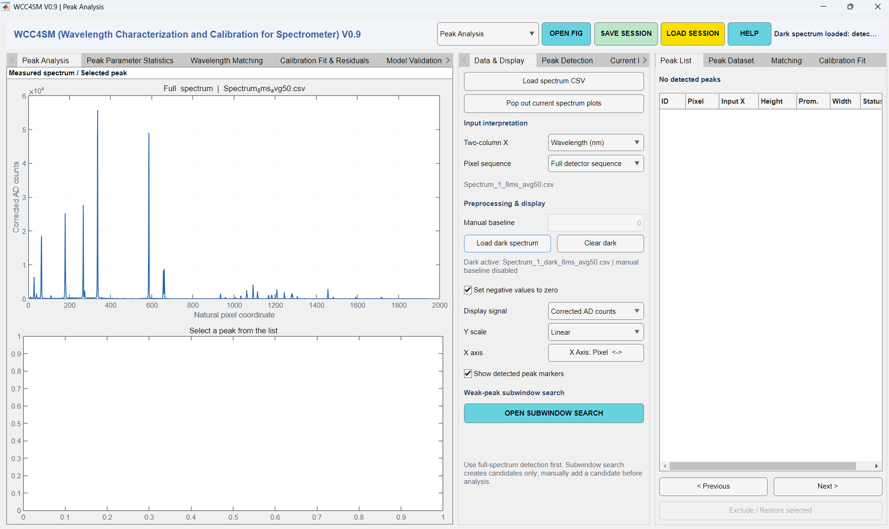
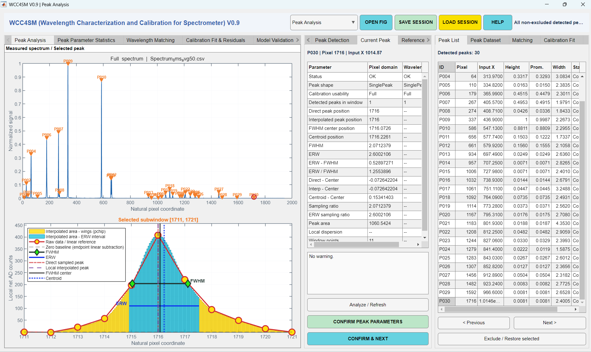
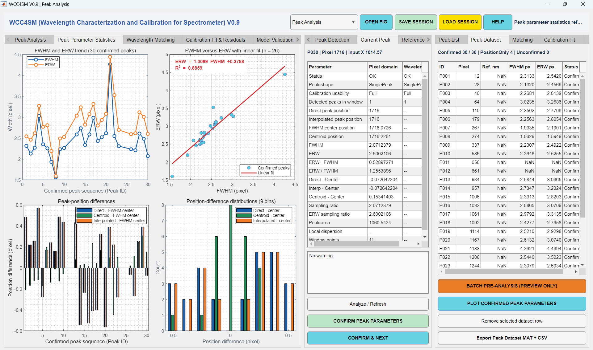
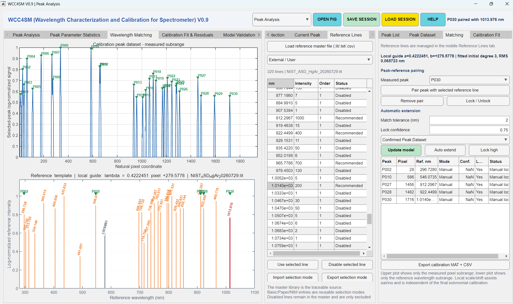
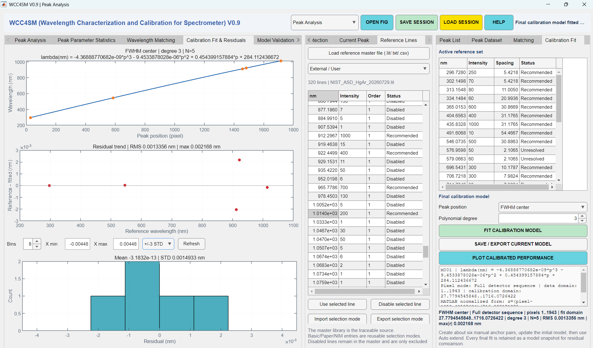
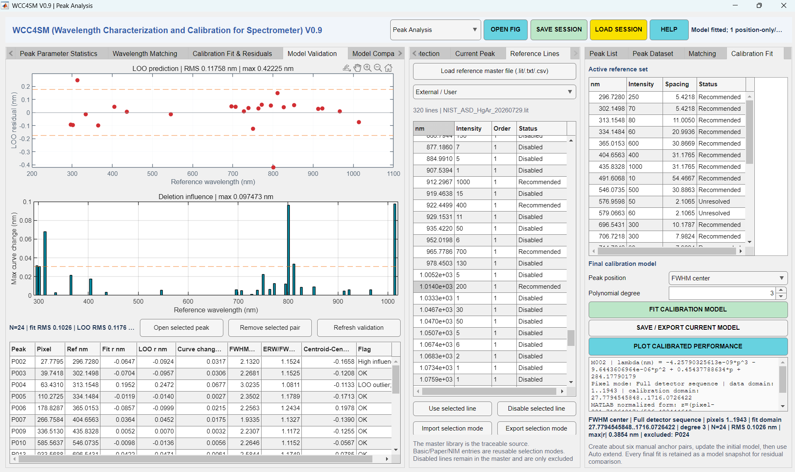
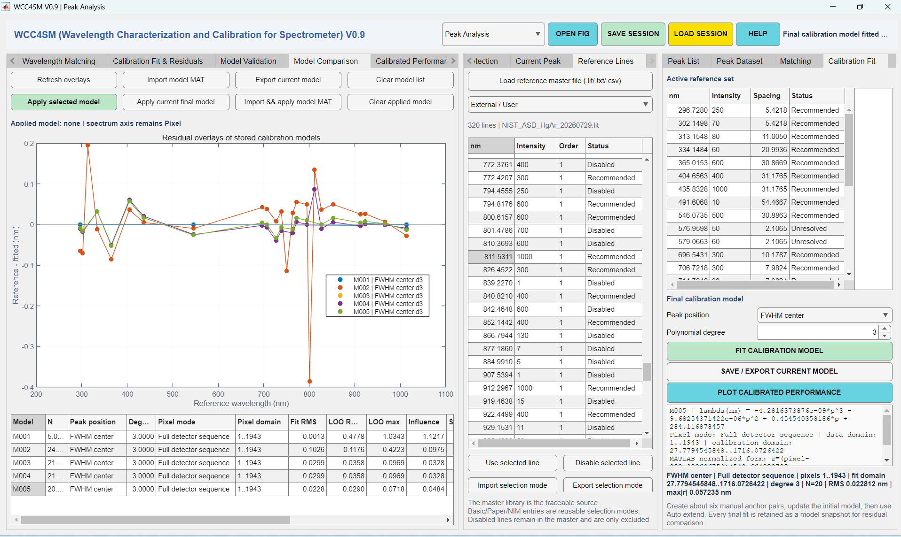
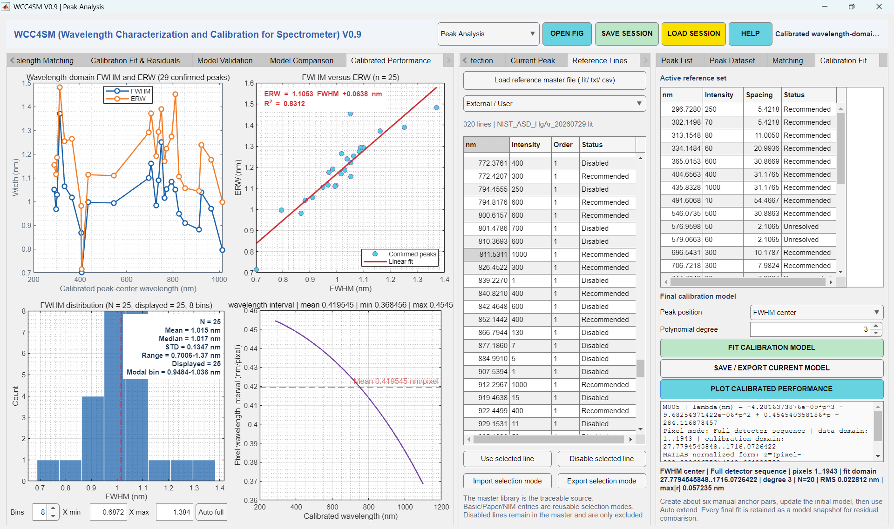
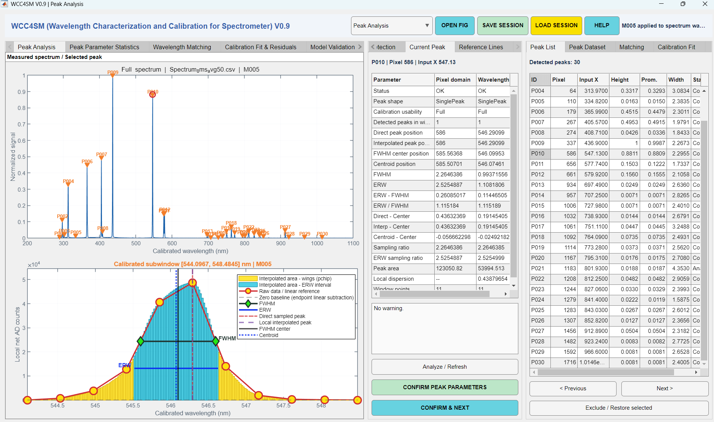
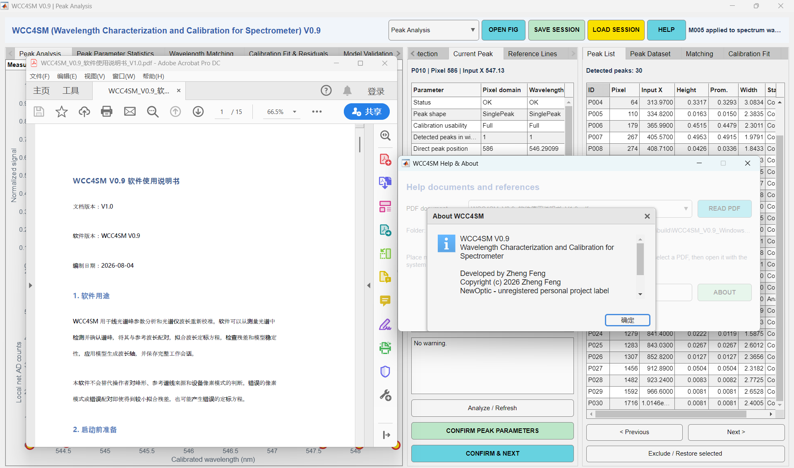

# WCC4SM V1.1 软件使用说明书

文档版本：V1.0

软件版本：WCC4SM V1.1

编制日期：2026-09-21

本说明书替代《WCC4SM V0.9 软件使用说明书 V1.1》。相对上一版的主要变化：
新增峰参数统计与 8x8 峰型图库、峰位交叉验证、五种峰位定义说明、全峰差值
Show 排除、Calibrated Performance 子视图等 V1.0/V1.1 功能章节；启动入口更新
为 `WCC4SM_V1_0`；补充性能优化后的操作建议。界面截图沿用 V0.9 版本，V1.1
新增视图的截图待补充。

## 1. 软件用途

WCC4SM 用于线光谱峰参数分析和光谱仪波长重新校准。软件可以从测量光谱中
检测并确认谱峰，将其与参考波长配对，拟合波长定标方程，检查残差和模型稳定
性，应用模型生成波长轴，并保存完整工作会话。

本软件不会替代操作者对峰形、参考谱线来源和设备像素模式的判断。错误的像素
模式或错误配对即使得到较小拟合残差，也可能产生错误的定标方程。

## 2. 启动前准备

### 2.1 环境

- MATLAB R2022a 或更高版本。
- Signal Processing Toolbox，用于 `findpeaks`。
- 将软件包完整复制到本机可写目录。
- MATLAB Current Folder 设置为软件包根目录。

启动：

```matlab
WCC4SM_V1_0
```

### 2.2 建议准备的文件

- 测量光谱 CSV。
- 与测量条件一致的暗光谱 CSV（如有）。
- 参考谱线主库或内置参考集。
- 参考线选择模式文件（如有）。
- 仪器编号、型号、操作者、测量时间和参考数据来源信息。

### 2.3 结果目录

建议每次实验使用独立结果目录，例如：

```text
WCC4SM_Results/
└─ 2026-09-21_instrument-A/
   ├─ session/
   ├─ model/
   ├─ peak-data/
   └─ notes/
```

项目根目录的 `result/` 不上传 GitHub，用户仍需自行备份实验结果。

## 3. 界面概览

顶部区域提供图形弹出（OPEN FIG）、会话保存/加载（SAVE SESSION / LOAD
SESSION）、HELP 和当前状态提示。

左侧页签：

- Data & Display：数据解释、像素模式、预处理和显示。
- Peak Detection：全谱检测与单峰分析参数。
- Current Peak：当前峰参数和确认操作。
- Reference Lines：参考谱线管理。

中央页签显示峰分析（含 8x8 峰型图库）、峰参数统计、波长配对、拟合残差、
LOO、模型比较、峰位交叉验证和校准后性能图。

右侧页签提供峰列表、已确认数据集、峰线配对和最终模型操作。



## 4. 选择输入解释

加载两列文件前，在 `Two-column X` 选择第一列含义：

- `Wavelength (nm)`：第一列是已有波长值。WCC4SM 仍建立独立的一基像素序列
  用于重新定标。
- `Pixel index`：第一列是像素相关输入坐标。

文件第一列必须严格递增。含非有限坐标或信号的行会被过滤；有效样本少于 3
个时拒绝加载。

## 5. 选择像素序列模式

这是定标前必须确认的设置。

### 5.1 Full detector sequence

选择场景：未定标设备输出整个探测器阵列，例如完整的 1–2048 像素。

含义：定标方程中的像素 1 是完整探测器序列第一点。

### 5.2 Valid-pixel sequence

选择场景：设备固件只输出裁剪后的有效区域，例如输出 1943 个有效样本。

含义：定标方程中的像素 1 是有效输出序列第一点，而不一定是物理探测器第一
像素。

### 5.3 注意事项

- 两种模式都从 1 开始，但不能互换。
- 必须在加载光谱前确认模式。
- 加载后修改模式会清除现有配对和模型，防止错误复用。
- 新模型会记录模式和数据范围。
- 应用显式模式不同的模型时，软件会拒绝操作。

## 6. 加载光谱与暗光谱

1. 在 Data & Display 选择输入解释和像素模式。
2. 点击 `Load spectrum CSV`。
3. 检查顶部状态中的样本数和主光谱图。
4. 如有暗光谱，点击 `Load dark spectrum`。
5. 没有暗光谱时，可设置 `Manual baseline`。
6. 根据需要选择是否将负值设为零。

暗光谱必须与测量光谱样本数及坐标对齐。加载暗光谱后人工常数基线自动禁用；
点击 `Clear dark` 可恢复人工基线模式。

预处理设置变化会清除旧峰检测和定标状态，需要重新检测。

## 7. 设置显示

`Display signal` 可选择：

- Corrected AD counts
- Normalized
- Raw AD counts

`Y scale` 可选择 Linear 或 Log。对数显示会隐藏非正值，但不会修改底层数据。

`X Axis` 在 Pixel 与 Wavelength 之间切换。只有应用有效定标模型后才可显示校准
波长轴，切换后光谱图标题会显示当前应用的模型名。切换时软件自动重新适配横轴
范围。

## 8. 全谱峰检测

在 Peak Detection 设置：

- Search normalized signal
- Min peak height
- Min prominence
- Min distance (px)
- Min width (px)
- Max width (px)

设置完成后点击 `CONFIRM & DETECT ALL PEAKS`。修改检测参数不会自动重跑，必须
再次点击按钮。

检测结果显示在 Peak List 和主光谱图。检测到的峰默认尚未确认，不能直接视为
最终校准点。



## 9. 弱峰子窗口搜索

当全谱归一化掩盖弱峰时：

1. 先完成全谱检测。
2. 在 Data & Display 点击 `OPEN SUBWINDOW SEARCH`。
3. 输入 Start pixel 和 End pixel。
4. 主光谱图出现两条起止虚线；修改数值后旧线被替换。
5. 设置子窗专用的高度、突出度、距离和宽度。
6. 点击 `DETECT CANDIDATES IN WINDOW`。
7. 在 Candidate 下拉框逐一查看候选。
8. 点击 `ADD SELECTED CANDIDATE TO PEAK LIST`。
9. 返回正常单峰分析并人工确认。

子窗搜索只生成候选，不自动写入已确认峰数据。关闭子窗后辅助线自动消失。

## 10. 分析和确认单峰

1. 在 Peak List 选择峰。
2. 在 Current Peak 检查局部峰图和警告。
3. 设置 Left pixels、Right pixels、Interpolation 和 Factor。
4. 点击 `Analyze / Refresh`。
5. 检查五种峰位定义的结果及峰形指标（见 10.1）。
6. 确认峰窗完整且基线合理后，点击 `CONFIRM PEAK PARAMETERS`。
7. 使用 `CONFIRM & NEXT` 可连续审核。

改变峰窗或插值设置后，原确认会失效，需要重新确认。明显混叠、截断或不适合
定标的峰可在 Peak List 中排除。

`BATCH PRE-ANALYSIS` 仅用于预览，不替代逐峰人工确认。

### 10.1 五种峰位定义

单峰分析同时给出五种峰位（数学定义见
`docs/WCC4SM_METHOD_SPECIFICATION.md`）：

- **Direct**：采样点中的最大信号位置。
- **Interpolated**：插值加密后的峰值位置。
- **FWHM center**：左右半高点的中点。
- **Centroid**：峰窗内信号的质心。
- **Gaussian fit**：高斯拟合中心（有条件输出：拟合质量不达标时留空）。

论文的交叉定义比较矩阵使用 4 种定义，是因为 Gaussian 拟合是有条件输出，
不适合进入全配对比较矩阵；GUI 保留 5 种以供完整诊断（另见
`docs/WCC4SM_V1.0_论文服务定版说明.md`）。

### 10.2 操作性能说明（V1.1 起）

- 选中峰的分析结果会按当前四个分析参数缓存：在 Peak List 中来回切换、或
  批量预分析后逐峰查看时，参数未变的峰直接复用结果，无需等待重算。
- 快速连续点击峰列表或 Previous / Next 时，软件只执行最后一次选择对应的
  完整分析，中间过程不排队积压。在较慢的机器上也可放心快速浏览。
- 修改 Left/Right pixels、Interpolation 或 Factor 后，下一次选中会自动重算，
  无需手动刷新。



## 11. 峰参数统计与 8x8 峰型图库

中央 `Peak Parameter Statistics` 页汇总全部检测峰的参数统计。

`Peak Analysis` 页内的 `8x8 peak-shape gallery` 子页以 8x8 网格展示全部
检测峰的局部峰形缩略图：每个子图不带刻度，标题给出 Peak ID 和中心波长
（未应用模型时退化为中心像素）。用于快速扫视峰形质量、发现混叠或截断峰。

## 12. 管理参考谱线

在 Reference Lines 可选择：

- Basic 21
- Paper 24
- NIM Certificate 34
- External / User

点击 `Load reference master file` 可载入 `.lit`、`.txt` 或 `.csv`。文件选择窗口
默认打开软件目录下的 `reference_data`；正式主库、选择模式和元数据保存在该目录，
示例库保存在 `reference_data/examples`。外部参考数据至少需要波长列，可包含强度和级次。

参考线可启用或禁用。选择模式只控制主库中哪些线参与当前分析，不应复制或
替代主参考库的溯源信息。

使用 `Import selection mode` 和 `Export selection mode` 保存选择状态。



## 13. 建立峰—参考线配对

1. 打开中央 Wavelength Matching 页。
2. 设置像素窗口和参考波长窗口。
3. 选择一个已确认测量峰。
4. 在参考表选择参考线。
5. 点击 `Pair peak with selected reference line`。
6. 建立约 6 个覆盖波段的可靠人工锚点。
7. 点击 `Update model` 建立初始模型。
8. 调整 Match tolerance 和 Lock confidence。
9. 点击 `Auto extend`。
10. 审查自动配对，必要时移除或锁定。

配对必须保持像素和参考波长顺序一致。不要只依据残差接受物理上可疑的配对。

## 14. 拟合最终模型

在 Calibration Fit：

1. 选择 Peak position 方法（对应 10.1 的峰位定义）。
2. 选择 Polynomial degree（1–6）。
3. 确保有效点数至少为 `degree + 2`。
4. 点击 `FIT CALIBRATION MODEL`。

结果区域显示：

- 像素模式
- 数据像素域
- 实际定标点域
- 阶数与点数
- 方程和归一化系数
- RMS 和最大绝对残差



## 15. 审查残差、LOO 和模型比较

Calibration Fit & Residuals 显示拟合曲线、残差趋势和直方图。

Model Validation 显示：

- LOO prediction residual
- 删除单点后的最大定标曲线变化
- 峰形辅助指标和异常标记

Model Comparison 可比较每次拟合快照，包括像素模式、像素域、阶数、RMS、LOO
和方程。推荐综合考察：

- 残差是否存在系统趋势。
- LOO 是否明显大于拟合残差。
- 个别点是否具有异常高的删除影响。
- 模型阶数是否与点数和物理平滑性相称。





## 16. 峰位交叉验证

中央 `Peak-position cross validation` 区域对同一批配对在不同峰位定义下的
差异做系统比较，服务论文分析。提供三个总览视图：

- **Mismatch metrics（2x3）**：六种失配指标同屏对比。
- **Application residuals（2x2）**：所选校准行的四条应用残差序列。
- **Residual histograms（4x4）**：与热图对齐的 4x4 残差直方图阵列。

每个总览都可用 OPEN FIG 弹出为单个可编辑 tiled figure。

**训练集选择**：交叉验证的训练集可以来自全部配对、当前最终模型、Model
Comparison 中所选模型，或 Set Design 中所选候选。Full fit 可在小子集上训练、
在全配对池上评估；LOO 仍是训练集上的留一诊断。Session 和 CSV 导出会保留
所选来源与 Train/Eval 计数。

## 17. 应用模型

在 Model Comparison 选择模型后点击 `Apply selected model`，或点击
`Apply current final model`。

软件会检查：

- 模型结构和系数。
- 像素模式是否匹配。
- 生成波长是否有限且严格递增。
- 是否有数据位于定标点范围之外。

如存在外推，软件显示比例并要求确认。应用成功后 Applied model 状态明确显示
模型名、像素模式、像素域、阶数和波长范围。

## 18. 校准后性能与波长依赖分析

点击 `PLOT CALIBRATED PERFORMANCE`，查看：

- 光谱分辨率随波长变化。
- 波长域 FWHM 与 ERW 关系。
- FWHM 分布。
- 相邻像素波长间隔。

非线性模型下，FWHM 使用左右半高点分别换算，不应把单点色散乘以像素宽度
作为唯一结果。

`Calibrated Performance` 子视图面向论文的峰位波长依赖分析：

- 全部检测峰的三序列（Direct / Interpolated / Centroid）差值图。
- 与基准匹配的 Centroid-minus-FWHM-center 图，可选 1–3 阶归一化多项式拟合。
- 图上选点与表格行同步高亮。
- 全峰差值表的 **Show 排除**：在表中取消勾选某行的 Show，可逆地把该峰从
  两张分析图中剔除——该峰仍保留在表中可追溯、不修改定标集、随 Session
  保存。勾选恢复即重新纳入。
- 支持 CSV 导出和 OPEN FIG 弹出。



## 19. 导出数据和模型

### 19.1 峰数据

`Export Peak Dataset MAT + CSV` 输出确认峰及对应光谱状态。

### 19.2 初始定标

`Export calibration MAT + CSV` 输出配对、初始/最终/历史模型、参考线、峰数据和
光谱。

### 19.3 最终模型

`SAVE / EXPORT CURRENT MODEL` 输出：

- `*_model.mat`：完整结构化模型、配对和参考线。
- `*_residuals.csv`：模式、数据域、定标域和逐点残差。
- `*_equation.txt`：可读方程、模式、域、系数和统计。

三种文件应具有相同文件名前缀并一起归档。

应用模型后可在波长坐标下重新检查谱峰和导出结果，如图 9 所示。



## 20. 保存和恢复会话

点击 `SAVE SESSION` 后填写：

- Operator
- Instrument ID / model
- Session notes
- Reference master library / version
- Authority/source
- Air/Vacuum/Unspecified
- Selection mode / version
- Traceability notes

会话保存光谱、暗光谱、峰（含逐峰分析结果与参数快照）、确认快照、参考线、
配对、模型、应用状态、像素模式和主要 UI 设置。

点击 `LOAD SESSION` 恢复。加载失败时软件保留原有效会话。V1.1 之前的会话
文件可以正常载入：逐峰分析参数快照字段会自动补齐，首次选中某峰时重算一次
后即恢复缓存加速。建议定期执行：

```text
保存 → 完全关闭软件 → 重新启动 → 加载 → 继续分析 → 再次保存
```

## 21. 图形导出

顶部选择图形页后点击 `OPEN FIG`，软件将该页子图分别复制到可编辑 MATLAB
figure。原 GUI 中的图不会被移除。交叉验证总览弹出为单个 tiled figure。

## 22. 常见问题

### 22.1 无法切换到波长轴

原因：尚未应用有效模型。先在 Model Comparison 应用模型。

### 22.2 模型因 Pixel sequence mismatch 被拒绝

原因：模型和当前数据分别属于 Full detector 与 Valid-pixel 模式。重新选择正确
数据/模式并重新定标，不要人工平移系数。

### 22.3 修改峰窗后确认消失

这是保护机制。新设置对应新的峰参数，必须重新确认。

### 22.4 子窗检测不到弱峰

缩小子窗，检查局部信号，降低最小高度或突出度，但仍需排除噪声候选。

### 22.5 暗光谱被拒绝

检查长度、坐标和测量条件。暗光谱必须与测量光谱对齐。

### 22.6 会话加载失败

确认文件含 `WCC4SMSession`，格式主版本受支持且结构未损坏。软件应保留当前
有效状态。

### 22.7 为什么 GUI 提供 5 种峰位定义而论文比较 4 种

Gaussian 拟合中心是有条件输出（拟合质量不达标时不给出），无法对全部配对
保证有值，因此论文的交叉定义比较矩阵只取其余 4 种。GUI 保留第 5 种用于
单峰诊断。详见 10.1。

### 22.8 快速点击峰列表后界面是否会积压任务

不会（V1.1 起）。分析进行中再次点击只记录最新选择，当前分析结束后执行
一次，不会逐次排队。若在旧版本上遇到点击积压导致的卡顿，请升级到 V1.1。

## 23. 数据安全与备份

会话和结果可能包含操作者、仪器编号、文件路径和实验数据。不要直接提交到
公开仓库。建议至少保留本机结果目录、机构存储和受控备份三份副本。

## 24. 相关文档

技术基线文档（`docs/`）：

- `WCC4SM_ARCHITECTURE.md`：分层架构、src 模块图、数据流。
- `WCC4SM_METHOD_SPECIFICATION.md`：预处理、HDR、D/I/F/C/G 峰位、定标、
  LOO、Gap、Influence、Compatibility、交叉验证的数学定义。
- `WCC4SM_DATA_DICTIONARY.md`：状态结构字段、ID 规则、状态枚举、文件格式索引。
- `WCC4SM_VALIDATION.md`：测试清单、基准用例、已知限制。

用户与流程文档（`docs/`）：

- `WCC4SM_V1.0_测试验证与验收说明_V1.0.md`
- `WCC4SM_V1.0_论文服务定版说明.md`
- `WCC4SM_V0.9.3_Set_Design操作与指标说明.md`
- `WCC4SM_INPUT_OUTPUT_DATA_FORMATS_V1.md`
- `WCC4SM_PIXEL_COORDINATE_SPEC_V1.md`
- `WCC4SM_CALIBRATION_MODEL_FORMAT_V1.md`
- `WCC4SM_SESSION_FORMAT_V1.md`

方法参考文献：

- Du B, Liu L, Wu D, et al. Multi-Parameter Wavelength Characterization of
  Array Spectrometers Under Near-Limit Sampling Conditions. *Applied
  Spectroscopy*. 2026. DOI: `10.1177/00037028261468369`。

论文引用信息可随软件公开。出版社排版 PDF 是否可以再次分发，取决于论文的开放
许可或出版协议；WCC4SM 的 Apache License 2.0 不适用于该论文 PDF。

## 25. PDF 帮助与 About

点击顶部 `HELP` 打开帮助窗口。软件递归扫描外部 `docs/` 目录及其子目录中的
PDF 文件，并在下拉框中显示相对文件名。点击 `REFRESH` 可在不重启软件的情况下
识别新加入的 PDF；选择文件后点击 `READ PDF`，由操作系统默认 PDF 阅读器打开。

`ABOUT` 显示软件版本、作者 Zheng Feng、联系邮箱 `feng1214@126.com`、个人项目
标签 NewOptic、Apache License 2.0 及 GitHub 项目地址。NewOptic 不是注册商标。



## 26. EXE 运行方式

Windows EXE 不包含 MATLAB Runtime，也不制作安装程序。目标电脑必须预先安装
MATLAB，或者安装与构建版本匹配的 MATLAB Runtime。EXE 旁应保留外部 `docs/`
和 `reference_data/`；用户可自行添加有合法使用权的 PDF 文档。WCC4SM 的
Apache License 2.0 不改变第三方论文、标准、参考数据或 MATLAB Runtime 的权利状态。

## 27. 版本与界面显示

自 V1.1 起，主窗口标题、界面标题、About 对话框和弹窗标题中的版本号统一
显示为 `V1.1`，由 `src/wc4sm_version.m` 集中提供；后续版本更新只需修改该文件。
顶栏右侧工具栏保留完整按钮文字。参考表中的 Intensity 和 Order 以整数显示；
这只控制界面格式，不改变主库中的数值，也不改变定标计算。
